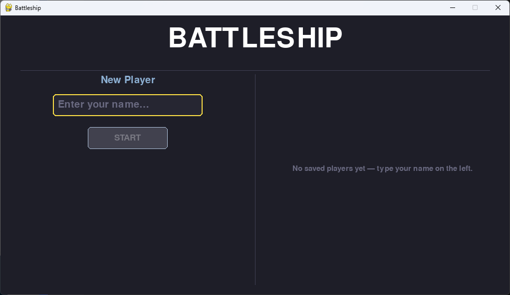
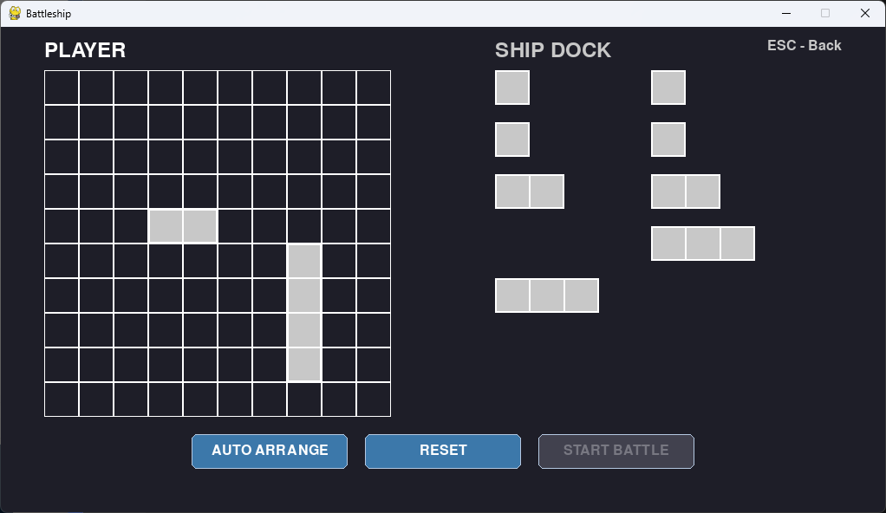

# 🚢 Battleship Game (AI-Engineered)

A fully functional, interactive Graphical User Interface (GUI) Battleship game built with Python.

The most unique aspect of this project is that it was developed using **Prompt Engineering** techniques. Despite having minimal prior experience with Python syntax, I leveraged AI to architect, code, and debug the entire application.

## 🌟 Key Features

- **Graphical User Interface (GUI):** A clean, modern interface for a smooth gaming experience.
- **Auto-Arrange:** Automatically place your ships with a single click.
- **Smart AI Opponent:** Play against a computer that challenges your strategy.
- **Game Persistence:** Track player names and save game states.
- **Interactive Gameplay:** Visual feedback for hits, misses, and victory/defeat screens.

## 📸 Screenshots

| Main Menu | Ship Placement | Battle Phase |
| :---: | :---: | :---: |
|  |  |  |

## 🧠 The Development Journey

This project was a practical challenge to test the limits of **Prompt Engineering**.

Inspired by the "Learn Prompt Engineering" course by **Zero To Mastery (ZTM)** taught by **Scott William Kerr**, I focused on:

- **Decomposition:** Breaking down complex game logic (grid systems, collision detection, turn-based mechanics) into logical prompts.
- **Iterative Debugging:** Using AI to interpret error logs and refine the code structure.
- **UI/UX Design:** Guiding the AI to create a user-friendly layout using Python libraries.

## 🚀 Getting Started

### Prerequisites

- **Python:** 3.10+ (Tested and fully functional on **Python 3.14.3**)
- **Library:** `pygame-ce` v2.5.7

### Installation

1. Clone the repository:

   ```bash
   git clone https://github.com/wdaz/Battleship.git
   ```

2. Navigate to the project folder:

    ```bash
    cd Battleship
    ```

3. Install the required library:

   ```bash
   python main.py
    ```

4. Run the game:

   ```bash
    python main.py
    ```

## 📖 Documentation

For a detailed guide on how to play the game, game rules, and controls, please refer to the:
[👉 User Guide](https://github.com/wdaz/Battleship/blob/main/docs/USER_GUIDE.md)

## 🛠️ Built With

- Python - Core Logic & GUI

- Prompt Engineering - Development Methodology

- AI Collaboration - Guided by ChatGPT / Claude

Developed with ❤️ by [Ruslan Hagverdi](https://github.com/wdaz)
